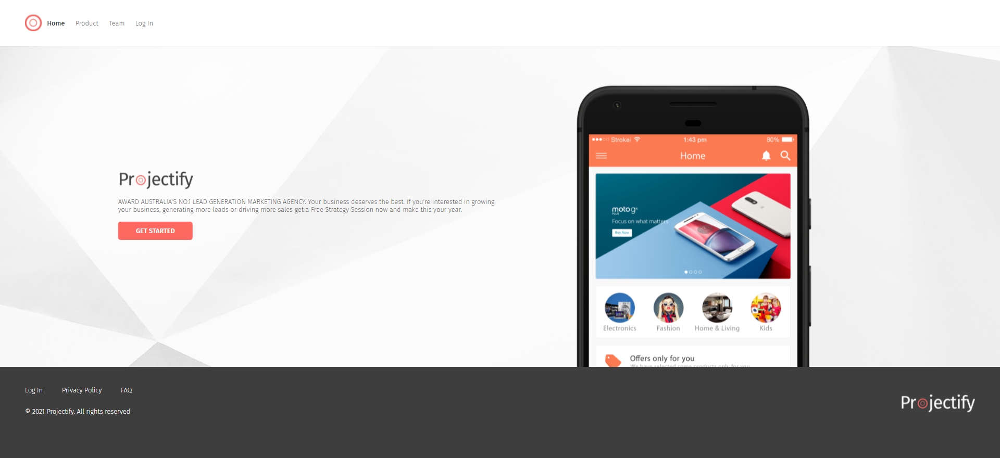
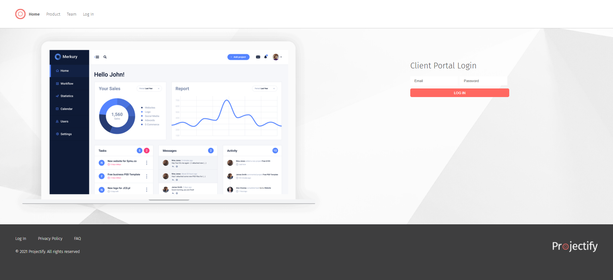
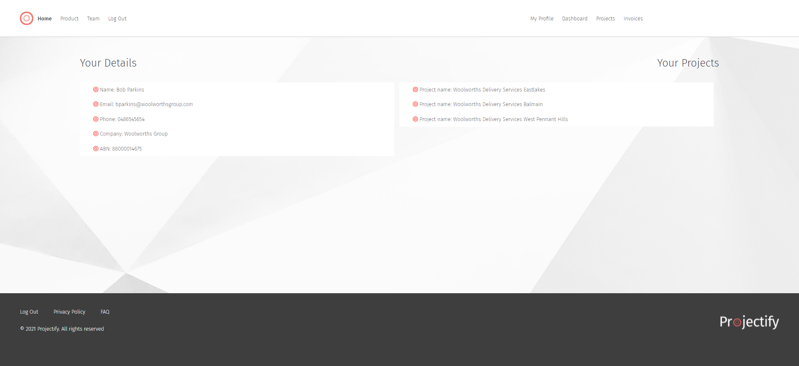
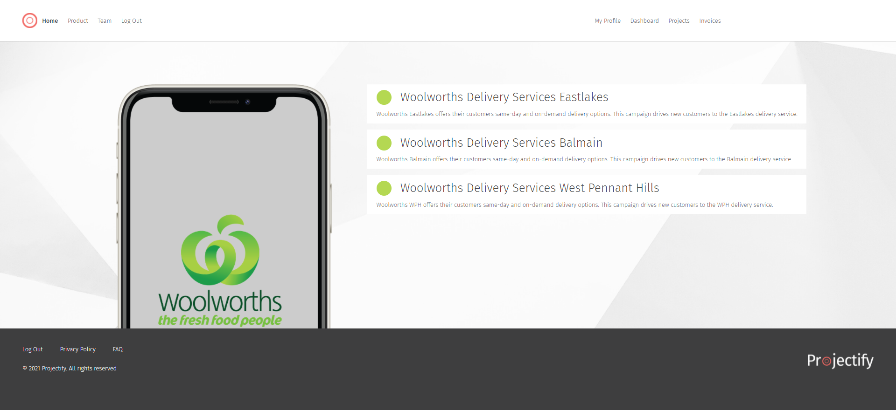
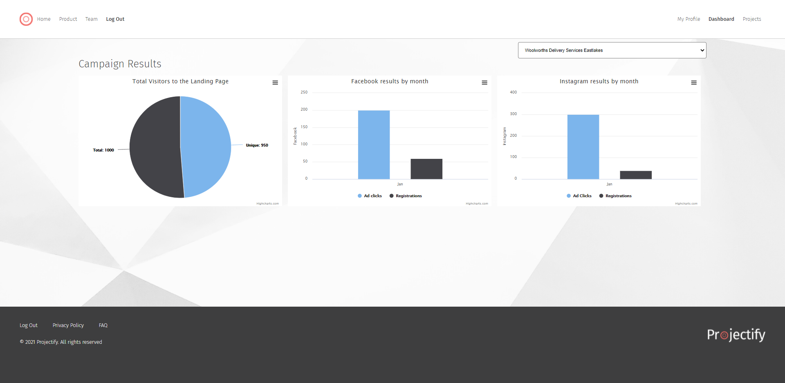

# PROJECTIFY

Link to the deployed application can be tested here on Heroku: [Projectify Marketing App](https://projectify-marketing-app.herokuapp.com/) and the project repository can be viewed here: [Projectify](https://github.com/mskippen/Projectify).

Feel free to test by logging in with these credentials:
- Username: bparkins@woolworthsgroup.com
- Password: WowPW1

## Description

PROJECTIFY is the all-in-one marketing lead generation tool for freelance and small-to-medium business owners. The app helps owners to manage their client's in their online business, digital marketing and advertising campaigns, 'projecting' user ad clicks and call-to-action registrations on client's Landing Page, Facebook and Instagram social media platforms. The application also manages and displays performance data of each campaign by full-month periods.

## Table of Contents

- [Installation](#installation)
- [Credits](#credits)
- [Usage](#usage)
- [License](#license)
- [Features](#features)
- [Tests](#tests)


## Installation

To install the files into your local repo, using Git Bash Terminal:

1) Create a folder locally to nominate for cloning from online repo
2) Clone with SSH by

```GitBash Commands
git clone git@github.com:mskippen/Projectify.git
 ```

Additionally, please install [NodeJS](https://nodejs.org/en/) and the below npm packages

```Terminal Commands
npm i init -y
npm i
npm i bcrypt
npm i connect-session-sequelize
npm i dotenv
npm i express
npm i express-handlebars
npm i express-session
npm i handlebars
npm i mysql2
npm i nodemon
npm i sequelize
 ```
Additionally Semantic CSS libaries are used for this project. [Code Highcharts](https://www.highcharts.com/blog/download/) was the new technology used to display client campaign performance data.

Before you run the code, please change scripts:{start: } to 'node server.js' in the package.json file and change your database login credentials in the (dotenv).env file.

It is highly encouraged to install [Insomnia](https://insomnia.rest/), [MySQL](https://www.mysql.com/products/community/) and [MySQL Workbench](https://dev.mysql.com/downloads/workbench/) for RESTful API and Database functionalities to work.

## Credits

This project is developed by Leon Hsu [leonhsu95](https://github.com/leonhsu95), Megan Skippen [mskippen](https://github.com/mskippen) and Peter Siapkis [Psiapkas](https://github.com/Psiapkas)

## Usage

The project should look like this:







Usage of this project is subject to the below license.

## License

Copyright 2021 © Projectify. All rights reserved.
Licensed under the [MIT](https://opensource.org/licenses/MIT).

Permission is hereby granted, free of charge, to any person obtaining a copy
of this software and associated documentation files (the "Software"), to deal
in the Software without restriction, including without limitation the rights
to use, copy, modify, merge, publish, distribute, sublicense, and/or sell
copies of the Software, and to permit persons to whom the Software is
furnished to do so, subject to the following conditions:

The above copyright notice and this permission notice shall be included in all
copies or substantial portions of the Software.

THE SOFTWARE IS PROVIDED "AS IS", WITHOUT WARRANTY OF ANY KIND, EXPRESS OR
IMPLIED, INCLUDING BUT NOT LIMITED TO THE WARRANTIES OF MERCHANTABILITY,
FITNESS FOR A PARTICULAR PURPOSE AND NONINFRINGEMENT. IN NO EVENT SHALL THE
AUTHORS OR COPYRIGHT HOLDERS BE LIABLE FOR ANY CLAIM, DAMAGES OR OTHER
LIABILITY, WHETHER IN AN ACTION OF CONTRACT, TORT OR OTHERWISE, ARISING FROM,
OUT OF OR IN CONNECTION WITH THE SOFTWARE OR THE USE OR OTHER DEALINGS IN THE
SOFTWARE.

## Features

- New Users can signup easily into the application. Their information is stored to JSON and saved into the database.
- BCrypt compares and hashes websites so that users can securely log in.
- As this is the prototype, it is assumed the the user will choose landing page, Facebook and Instagram campaign programmes together. 
- Users can access their dashboard where their profiles, active projects and invoices are displayed.
- The graph displays all of the client's project perofrmance as per the Campaign data, containing landing page, Facebook and Instagram page clicks and registrations figures in the database.


## Tests

This project can be tested with [JS Validation Service](https://jshint.com/). The [Insomnia](https://insomnia.rest/) Design and API Client 
is used to test these functionalities as it can GET, POST, PUT and DELETE Data from the given URL without Front End UI Buttons or Designs.
You will also require [MySQL](https://www.mysql.com/products/community/) and [MySQL Workbench](https://dev.mysql.com/downloads/workbench/) for this application's database.


